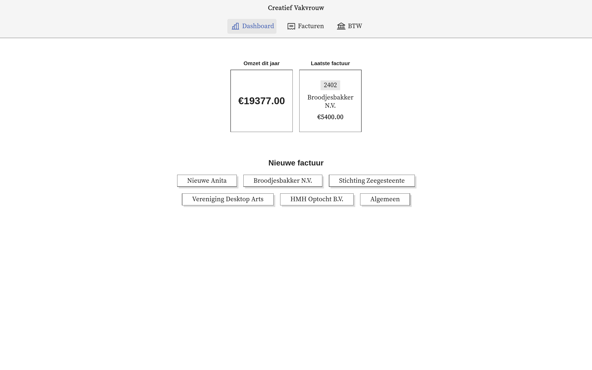
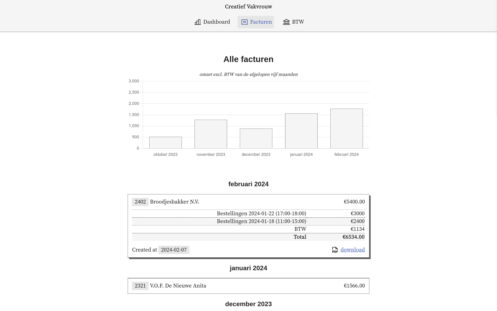
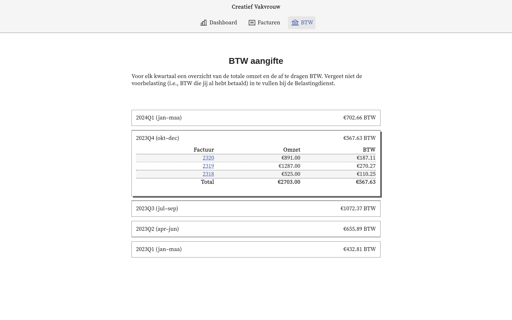

# Small business financials

A minimalistic web app to manage and automate a small business's financial administration.

This software is heavily overfitted on Noemi's specific usecases.
It aims to provide the following workflows:

- [x] Generate invoices (prefer external sources above manual input)
- [x] Prepare BTW-aangifte
- [ ] Keep track of balance sheet
- [ ] Keep track of income and costs


<center><em>The main dashboard linking to all actions</em></center>

## Getting started

1. Check-out source code
2. Dump `clients.json` in the root, e.g.:
```json
  {
    "client-key": {
      "name": "Client A",
      "address": "Main Road 12",
      "zip": "1234AB, Amsterdam"
    }
  }
```
3. Set `LINDA_AUTH` environment variable to a valid session key
4. Run development server with `cargo run -- server`

### Docker

1. Check-out source code
2. Dump `clients.json` in the root, e.g.:
```json
  {
    "client-key": {
      "name": "Client A",
      "address": "Main Road 12",
      "zip": "1234AB, Amsterdam"
    }
  }
```
3. Create an env file for Docker, e.g. `env.list`:
```
LINDA_AUTH=csrftoken=value; sessionid=value
```
4. Build an image `docker build -t creatief-vakvrouw .`
5. Run the server:
```sh
docker run --env-file env.list -p 8080:1728 --detach --rm --name facturen creatief-vakvrouw:latest
```

### Fly.io

The repository includes a `fly.toml` file.
To use it, modify the app name and volume source to your respective deployment and run `fly deploy`.

## Screenshots


<center><em>Complete history of invoices grouped by month</em></center>


<center><em>Overview of VAT per quarter as preparation for the tax agency filings</em></center>


<center><em>Form to generate and store a new invoice. Will remember past clients to speed up fill-out</em></center>

## Ideas

- Use [WeasyPrint](https://doc.courtbouillon.org/weasyprint/stable/) instead of LaTeX to create PDF invoices
- Use [Typst](https://github.com/typst/typst) typesetting system instead of LaTeX
